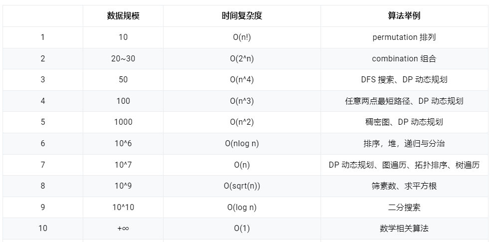

## 时间复杂度

> 1s 内能解决问题的数据规模：10^6 ~ 10^7

- O(n^2) 算法可以处理 10^4 级别的数据规模(保守估计，处理 1000 级别的问题肯定没问题)
- O(n) 算法可以处理 10^8 级别的数据规模(保守估计，处理 10^7 级别的问题肯定没问题)
- O(nlog n) 算法可以处理 10^7 级别的数据规模(保守估计，处理 10^6 级别的问题肯定没问题)

