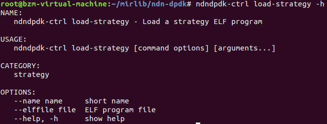
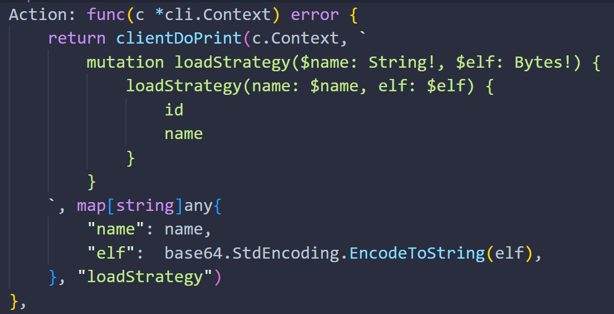
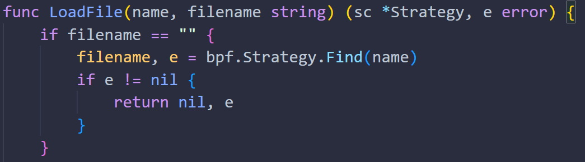
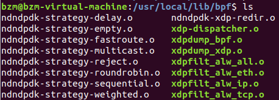
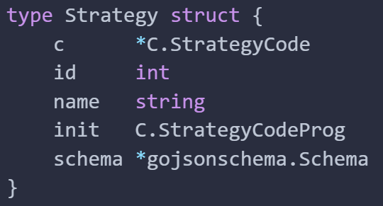
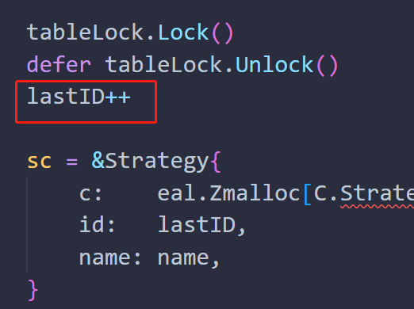
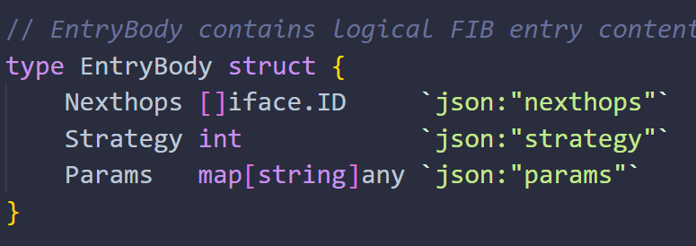

## bpf中转发策略调用

1.在ndndpdk-ctrl命令中对策略进行加载

2.代码位置(cmd/ndndpdk-ctrl/strategy.go 45-88行)

传入输入的名字和elf文件，返回策略id(稍后会用到)和名字

3.上述代码调用(container/strategycode/gql.go 51-70行)

4.调用(container/strategycode/strategy.go 132-208行)Load函数，将elf文件(字节形式)写入一个临时的.o文件

5.该函数调用LoadFile函数。其中filename为上一步中的临时文件路径

作用：读取ELF文件并返回策略

该部分代码指，如果filename为空则查找默认位置的elf文件。(感觉如果是4调用的loafFile，那这个filename就永远不会为空，只有直接LoadFile(name, "")时才会为空)

5.1.如果filename为空，那么就调用(bpf/bpf.go 32-58行)的Find方法，根据名称返回默认的.o elf文件路径

默认的应该在/usr/local/lib/bpf目录下

6.继续第5步的LoadFile函数，主要就是根据文件把strategy给实例化出来，其中strategy结构体如下

其中id就是根据table表的latID来控制的，互斥锁，策略table位置(container/strategycode/table.go)
最后返回这个strategy

另外：与pmir不同，ndn-dpdk中的每个fib条目包含一个策略
