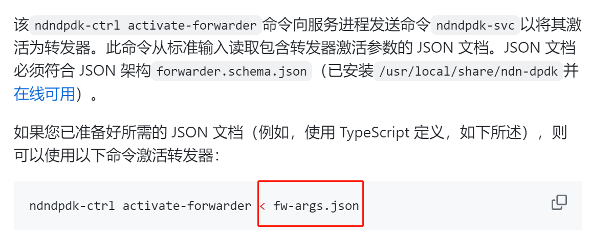
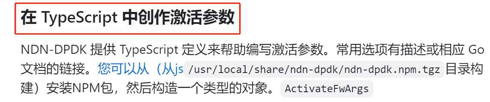
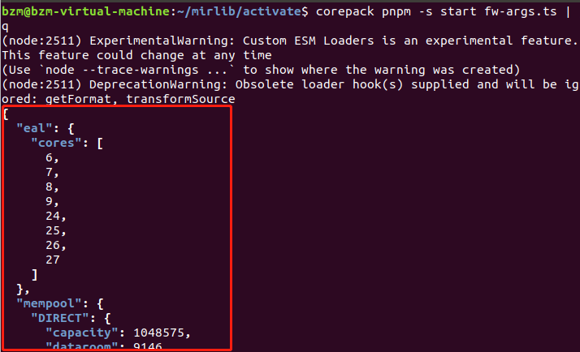
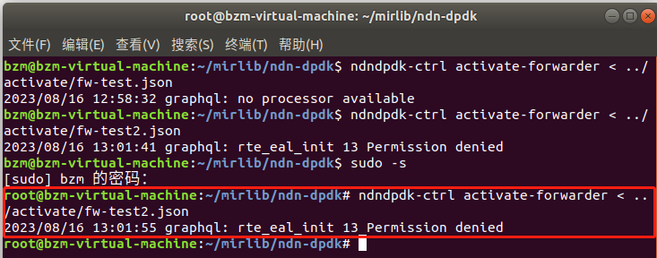
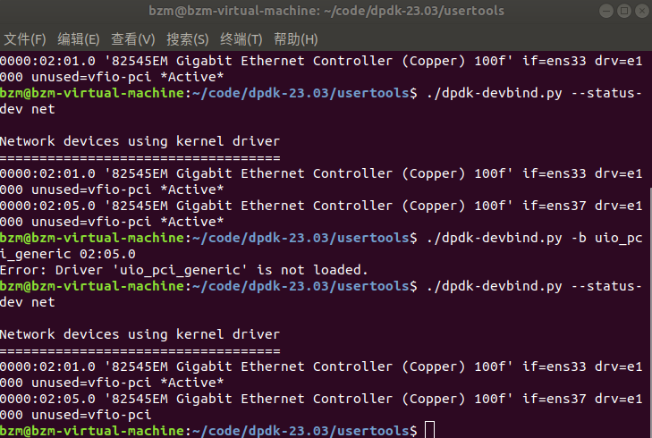
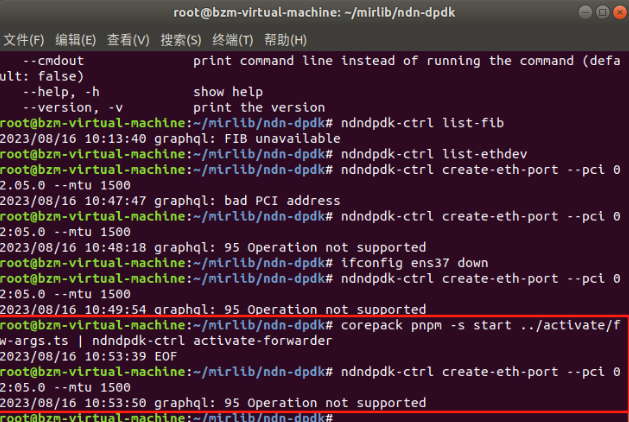

## NDN-DPDK转发器激活和使用

### 激活
1.官方md文档中有个fw-args.json文件，为初始化配置文件，该文件并不存在代码中，可知是生成的或按照forwarder.schema.json格式进行编写的

2.后文中提到在 TypeScript 中创作激活参数

可想而知应该是通过ts来生成激活配置json文件

3.源码样例目录下有fw-args.ts，可知通过该ts文件生成json
ts生成json步骤：
corepack pnpm install以安装依赖项
运行corepack pnpm -s start fw-args.ts | jq即可查看 JSON 文档

4.此时可以根据json文档进行激活
> ndndpdk-ctrl activate-forwarder < fw-args.json

报错，初步排查是eal中core核心问题，有点知识盲区，未激活成功

### 使用
1.创建以太网接口
> ndndpdk-ctrl create-eth-port --pci 04:00.0 --mtu 9000

报错pci找不到，应该是pci参数不对，其中pci是pci驱动器的地址

2.查找官方文档中的face创建部分，找到答案

//list PCI addresses
> dpdk-devbind.py --status-dev net

如果只有一个的话需要再加几个网络适配器
//change kernel driver binding (only needed for some NICs, see DPDK docs on what driver to use)
> sudo dpdk-devbind.py -b uio_pci_generic 0X:XX.XX

报错，怀疑是未成功激活转发器导致