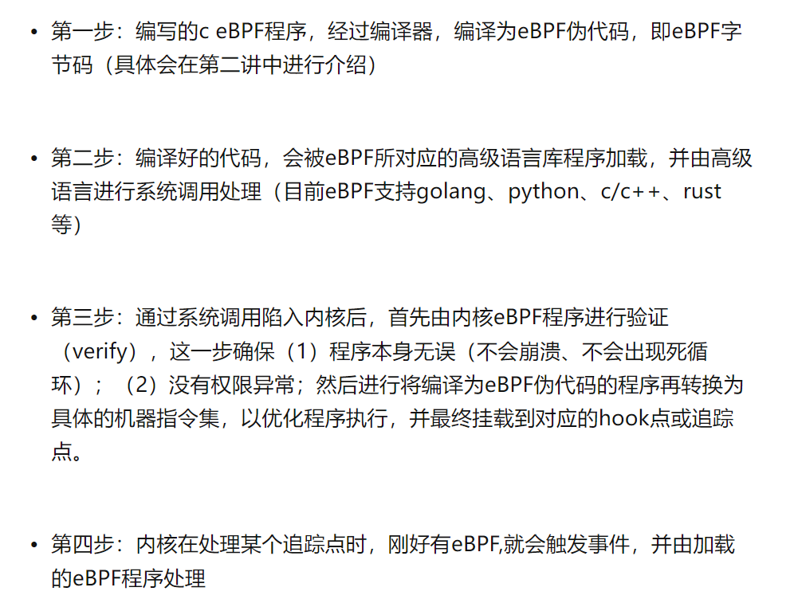

## bpf

DPDK让用户态程序直接处理网络流，bypass掉内核，使用独立的CPU专门干这个事。

XDP让灌入网卡的eBPF程序直接处理网络流，bypass掉内核，使用网卡NPU专门干这个事。

XDP的全称是： eXpress Data Path；
XDP 是Linux 内核中提供高性能、可编程的网络数据包处理框架。
直接接管网卡的RX数据包（类似DPDK用户态驱动）处理；
通过运行BPF指令快速处理报文；
和Linux协议栈无缝对接；

XDP 是一种特殊的 eBPF 程序，在数据包处理上因为在协议栈之前就可以处理数据，所以有非常高的性能

##